<h1 align="center">Hi, I'm Ronin 👋</h1>

  Developer &amp; Programmer based in Melbourne, Australia 🇦🇺

  
  
  

---

## 🧭 About

I build things for the web — turning ideas into working software, one commit at a time.
Most of my time goes into full-stack work: designing the data layer, wiring up the API, and
making the interface feel effortless. I'm happiest when I'm learning a tool I haven't used before.

- 🔭 Currently building full-stack projects with **Laravel** and **React**
- 🌱 Always picking up something new — frameworks, patterns, and better ways to ship
- 🤝 Open to collaborating on open source and side projects
- 💬 Ask me about PHP, JavaScript, or anything in between

> **Why "Ronin"?** A *rōnin* is a masterless wanderer — no fixed path, always moving toward
> the next challenge. That's roughly how I approach technology.

---

## 🛠️ Tech Stack

**Frontend**

  
  
  
  

**Backend**

  
  
  

**Data &amp; Tooling**

  
  
  

---

## 📊 GitHub Stats

  
  

---

## 🐍 Contribution Snake

<picture>
  <source media="(prefers-color-scheme: dark)" srcset="snake-dark.svg">
  <source media="(prefers-color-scheme: light)" srcset="snake-light.svg">
  
</picture>

  
    Drawn by <a href="https://roninimous.github.io/github-snake/index.html?u=roninimous">Contribution Snake</a> — a no-dependency
    SVG generator I built. <a href="https://roninimous.github.io/github-snake/readme/index.html">Put it on your own README →</a>
  

---

  <i>Thanks for stopping by — let's build something worth shipping.</i> 🚀

